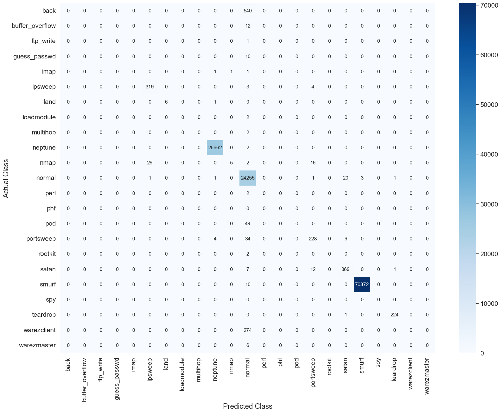

# 🛡️ Machine Learning for Intrusion Detection in Cybersecurity 🌐

The Machine learning framework aims as  enhancing detections  and mitigating intrusions in real-time in network data results in 
confusion matrix classifying attack types in data. 

<table>
  <tr>
    <td></td>
    <td></td>
  </tr>
</table>

# Method Description 🛠️
Machine learning and deep learning models aims to learn a function $f(x; \theta)$ parameterized by weights and biases $\theta$ that minimizes a predefined loss function $L(y, F(x; \theta))$. 
The goal is to adjust parameters $\theta$ to create a function $f_{\theta} : X \rightarrow Y$ that accurately predicts labels $y$ for new data $x$. 
The parameters $\theta$ are optimized by minimizing the loss function over the training dataset:

$$
\theta^* = \arg\min_{\theta} \sum_{i=1}^{N} L(y_i, F(x_i; \theta))
$$

where $\theta^*$ represents the optimal parameters of the neural network. The gradient of the loss function is computed as:

$$
\nabla_{\theta} L(x, \hat{y}) = -\sum_{i=1}^{n} \nabla_{\theta} L(f(\theta, x_i), \hat{y}_i)
$$

where $f$ represents the neural network parameterized by $\theta$, and $\hat{y}_i$ denotes the predicted output for the $i$-th sample.

A deep learning model processes input through multiple layers to produce an output, compares it to the target, and uses backpropagation to compute gradients and optimize parameters.

**Intrusion Detection Optimization Problem**
In intrusion detection, this algorithm categorizes network flows as benign or malicious, using a machine learning model to map input $x$ to output $y$. 
Output $y$ corresponds to a class determined by $i$ in $f : \mathbb{R}^n \rightarrow {1, \ldots, k}$, where $k = 2$ for binary and $k \geq 3$ for multi-classification of attacks, 
maximizing $y = (f(x)_i + \epsilon_i)$ with model prediction $f(x)_i$ and uncertainty $\epsilon_i$.

The decision process categorizes network flows as :
**For Binary Classification**

$$
\text{Classify as malicious: } \begin{cases} 
1 & \text{if } P(M) > \tau \\
0 & \text{otherwise}
\end{cases}
$$

$$
\text{Classify as benign: } \begin{cases} 
1 & \text{if } P(M) \leq \tau \\
0 & \text{otherwise}
\end{cases}
$$

**For multi-classification:**

$$
\text{Classify as class } k: \begin{cases} 
1 & \text{if } P(k) = \max(P(1), P(2), \ldots, P(K)) \\
0 & \text{otherwise}
\end{cases}
$$

where $P(k)$ represents the probability that a given observation belongs to class $k$, and $K$ represents the total number of classes.

### Classification Techniques 📊
- **Unsupervised Learning:** Employing k-means clustering and PCA for anomaly detection and dimensionality reduction.
- **Supervised Learning:** Training MLP, CNN, and RNN models on labeled datasets for precise threat classification.

### Supervised Neural Network Methods 🧠
Unleash the power of AI-driven classification with:

- **MLP (Multi-Layer Perceptron):** Versatile and powerful for supervised learning tasks.
- **CNN (Convolutional Neural Network):** Specialized in extracting features from sequential data.
- **RNN (Recurrent Neural Network):** Ideal for capturing temporal patterns in network traffic.

### Experiments 🧪

Dive into the experiments that push the boundaries of cybersecurity:

- Evaluating model performance on diverse datasets including KDDCup '99.
- Metrics analysis: Precision, recall, and F1-score to gauge detection efficacy.

### Results 📈

Discover groundbreaking insights:

- Enhanced accuracy in identifying advanced cyber threats.
- Minimized false positives through optimized ML models.
- Comparative performance of MLP, CNN, and RNN in intrusion detection tasks.

### References 📚

- [Reference 1: Title or Description of the Reference](link)
- [Reference 2: Title or Description of the Reference](link)
- [Reference 3: Title or Description of the Reference](link)

## Usage 🚀

Clone the repository to replicate experiments or explore the implementation of ML-based intrusion detection.

## Conclusion 🌟

Unlock the potential of ML in cybersecurity, leveraging k-means clustering and PCA for proactive intrusion detection systems that safeguard digital assets effectively.
