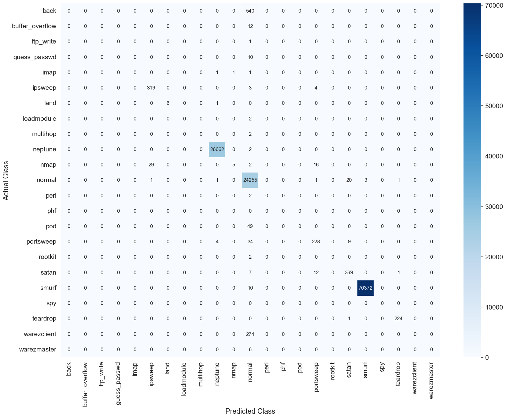
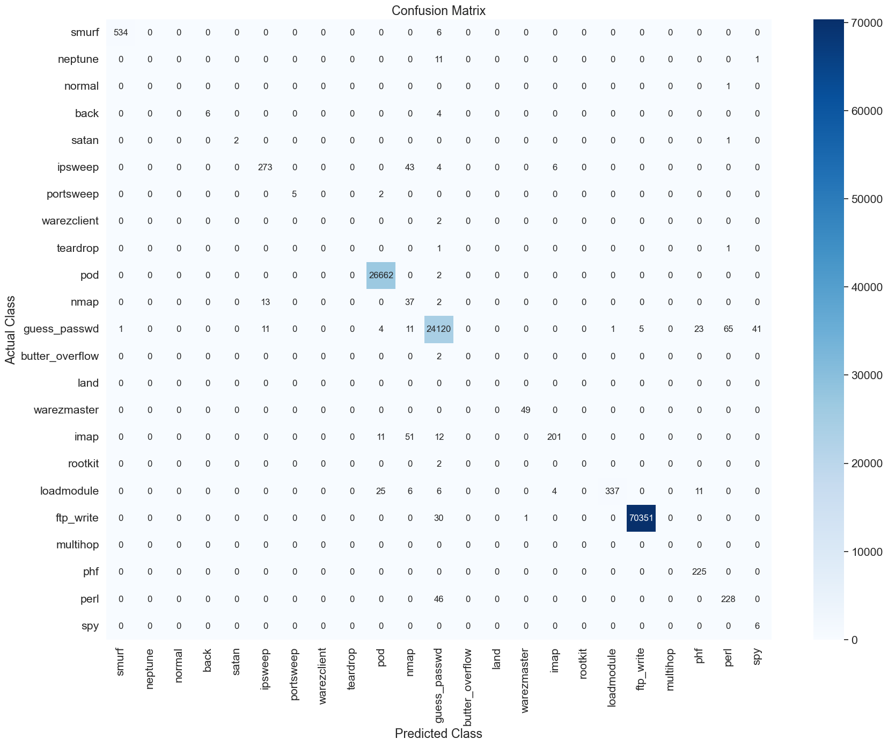
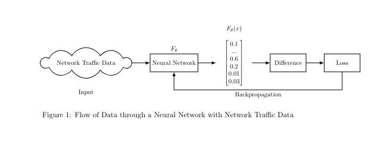

# 🛡️ Machine Learning for Intrusion Detection in Cybersecurity 🌐
Welcome to the repository showcasing my work on leveraging Machine Learning (ML) for Intrusion Detection in Cybersecurity!
This project focuses on leveraging machine learning algorithms, particularly optimizing neural networks, to reduce false positives and effectively identify advanced threats in real-time. Training results are displayed confusion matrix classifying attack types in data. 

<table>
  <tr>
    <td></td>
    <td></td>
  </tr>
</table>


# Method Description 🛠️
Machine learning and deep learning models aims to learn a function $f(x; \theta)$ parameterized by weights and biases $\theta$ that minimizes a predefined loss function $L(y, F(x; \theta))$. 
The goal is to adjust parameters $\theta$ to create a function $f_{\theta} : X \rightarrow Y$ that accurately predicts labels $y$ for new data $x$. 
The parameters $\theta$ are optimized by minimizing the loss function over the training dataset:

$$
\theta^* = \arg\min_{\theta} \sum_{i=1}^{N} L(y_i, F(x_i; \theta))
$$

where $\theta^*$ represents the optimal parameters of the neural network. The gradient of the loss function is computed as:

$$
\nabla_{\theta} L(x, \hat{y}) = -\sum_{i=1}^{n} \nabla_{\theta} L(f(\theta, x_i), \hat{y}_i)
$$

and $f$ represents the neural network parameterized by $\theta$, and $\hat{y}_i$ denotes the predicted output for the $i$-th sample.


A deep learning model processes input through multiple layers to produce an output, compares it to the target, and uses backpropagation to compute gradients and optimize parameters.


**Intrusion Detection Optimization Problem**
In intrusion detection, this algorithm categorizes network flows as benign or malicious, using a machine learning model to map input $x$ to output $y$. 
Output $y$ corresponds to a class determined by $i$ in $f : \mathbb{R}^n \rightarrow {1, \ldots, k}$, where $k = 2$ for binary and $k \geq 3$ for multi-classification of attacks, 
maximizing $y = (f(x)_i + \epsilon_i)$ with model prediction $f(x)_i$ and uncertainty $\epsilon_i$.


The decision process categorizes network flows as :

**For Binary Classification**

$$
\text{Classify as malicious: } \begin{cases} 
1 & \text{if } P(M) > \tau \\
0 & \text{otherwise}
\end{cases}
$$

$$
\text{Classify as benign: } \begin{cases} 
1 & \text{if } P(M) \leq \tau \\
0 & \text{otherwise}
\end{cases}
$$

**For multi-classification:**

$$
\text{Classify as class } k: \begin{cases} 
1 & \text{if } P(k) = \max(P(1), P(2), \ldots, P(K)) \\
0 & \text{otherwise}
\end{cases}
$$

where $P(k)$ represents the probability that a given observation belongs to class $k$, and $K$ represents the total number of classes.


# Experiments 🧪

The different experiments can be executed as Jupyter notebooks in the notebooks folder.

### Classification Techniques 📊
- **Unsupervised Learning:** Employing k-means clustering and PCA for anomaly detection and dimensionality reduction.
- **Supervised Learning:** Training MLP, CNN, and RNN models on labeled datasets for precise threat classification.


### Supervised Neural Network Methods 🧠
Classification with:

- **MLP (Multi-Layer Perceptron):** High accuracy in identifying malicious vs. benign traffic.
- **CNN (Convolutional Neural Network):** Superior accuracy with low false positives and negatives.
- **RNN (Recurrent Neural Network):** Effective in capturing temporal patterns and real-time detection.
- **SNN (Sequential Neural Network):** Most efficient in real-time detection with temporal dependencies.
- **Metrics analysis:** Precision, recall, and F1-score to gauge detection efficacy.

# Results 📈

Discover groundbreaking insights:

- Enhanced accuracy in identifying advanced cyber threats.
- Minimized false positives through optimized ML models.
- Comparative performance of MLP, CNN, and RNN in intrusion detection tasks.


## Usage 🚀

## Directory Structure
```
Project/
│
├── notebooks/
│ └── Supervised_Training_KDD99.ipynb
│
├── src/
│ ├── data/
│ │ ├── preprocess.py
│ │ └── 
│ │
│ ├── models/
│ │ ├── cnn_model.py
│ │ ├── mlp_model.py
│ │ └── rnn_model.py
│ │
│ ├── utils/
│ │ ├── optimizers.py
│ │ └── regularizers.py
│ │
│ └── main.py
│
├── tests/
│ ├── test_optimizers.py
│ ├── test_regularizers.py
│ ├── test_cnn_model.py
│ ├── test_mlp_model.py
│ └── test_rnn_model.py
│
├── README.md
├── requirements.txt
└── .gitignore   


## How to Run

1. Clone the repository.
2. Install the required dependencies using `pip install -r requirements.txt`.
3. Run the main script `python src/main.py`.
4. The models are trained and tested on the KDD99 Cup Dataset.

## References

1. KDD Cup 1999 Dataset: http://kdd.ics.uci.edu/databases/kddcup99/kddcup99.html
2. TensorFlow: https://www.tensorflow.org/

## Conclusion 🌟

Unlock the potential of ML in cybersecurity, leveraging NN for intrusion detection systems that safeguard digital assets effectively.


### References 📚

- [Reference 1: Title or Description of the Reference](link)
- [Reference 2: Title or Description of the Reference](link)
- [Reference 3: Title or Description of the Reference](link)
